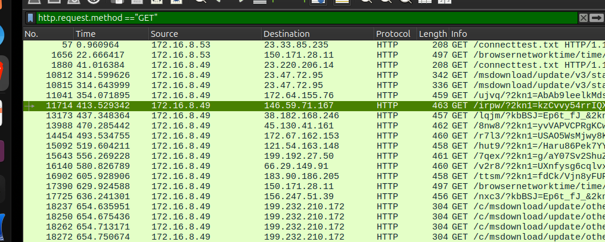
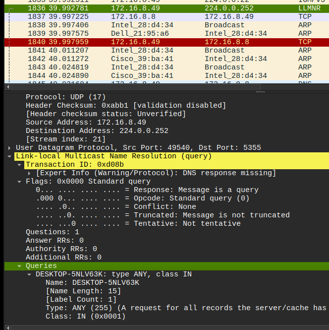
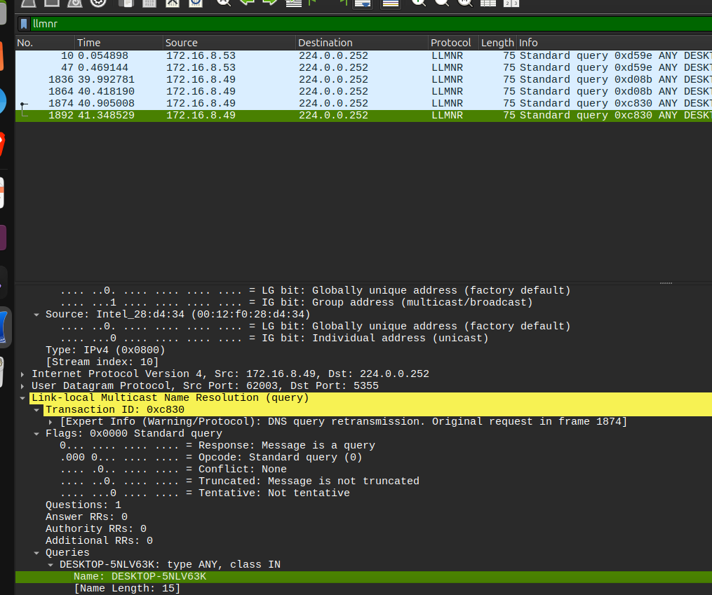
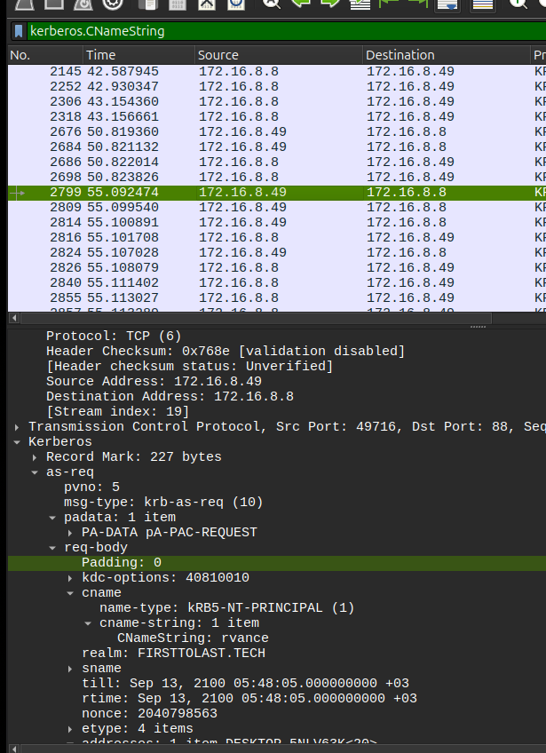
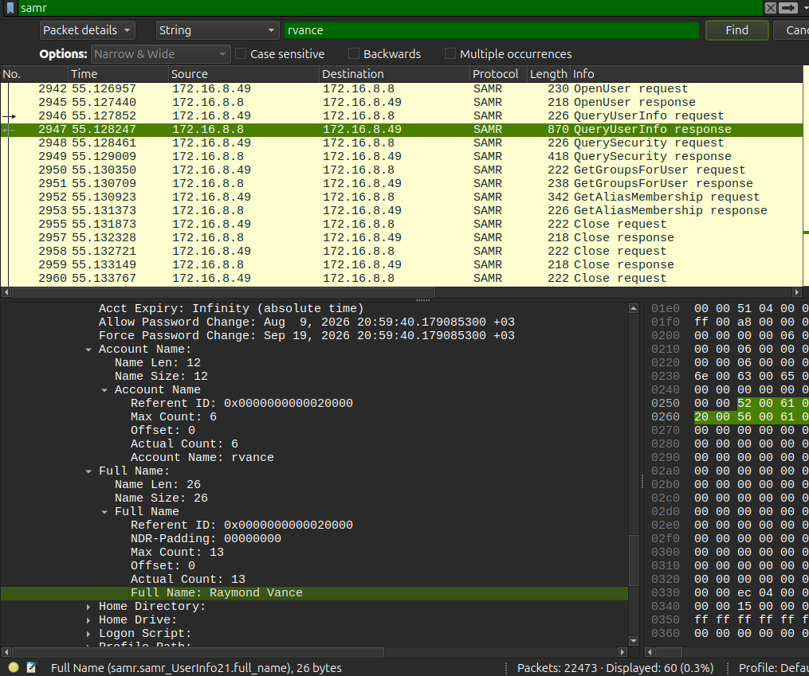

**Question:** [Malware Traffic Analysis — 2026-08-09](https://www.malware-traffic-analysis.net/2026/08/09/index.html?utm_source=chatgpt.com)

## 1. Finding the infected IP

The alerts showed **FormBook C2 check-ins using HTTP GET requests**, so I started by filtering HTTP GET traffic.

**Filter used:**

```
http.request.method == "GET"
```

I noticed that `172.16.8.49` was communicating with several IP addresses that matched the C2 IPs from the alerts. So I identified it as the infected host.  



## 2. Finding the MAC Address

Next, I checked the Ethernet information for traffic from the infected host.

**Filter used:**

```
arp
```

The MAC address associated with `172.16.8.49` was:

```
00:12:f0:28:d4:34
```

I then used this filter to investigate the device's traffic:

```
eth.addr == 00:12:f0:28:d4:34
```



## 3. Finding the Hostname

I used LLMNR traffic to find the Windows hostname.

**Filter used:**

```
llmnr
```

The LLMNR query showed:

```
DESKTOP-5NLV63K
```

So the hostname is **DESKTOP-5NLV63K**.




## 4. Finding the User Account

I checked the Kerberos traffic to identify the user account.

**Filter used:**

```
kerberos.CNameString
```

The packet showed:

```
CNameString: rvance
```

The computer account also appeared as `desktop-5nlv63k$`, but the `$` indicates a computer account. Therefore, **rvance** is the actual user account.


## 5. Finding the Full Name

Finally, I used the SAMR protocol.

**Filter used:**

```
samr
```

I found a `QueryUserInfo` response containing:

```
Account Name: rvance
Full Name: Raymond Vance
```




ANSWERS:
Victim Details:
IP address: 172.16.8[.]49
Host name: DESKTOP-5NLV63K
MAC address: 00:12:f0:28:d4:34
Windows user account name: rvance
Full name of the user: Ryamond Vance

### What I learned

This lab helped me understand how different protocols can be used together during a network investigation: **HTTP → ARP → LLMNR → Kerberos → SAMR**. Each protocol gave me another piece of information about the infected device.
