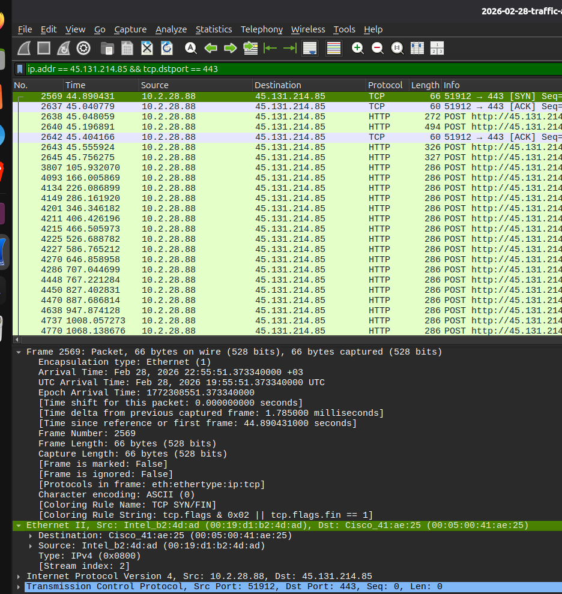
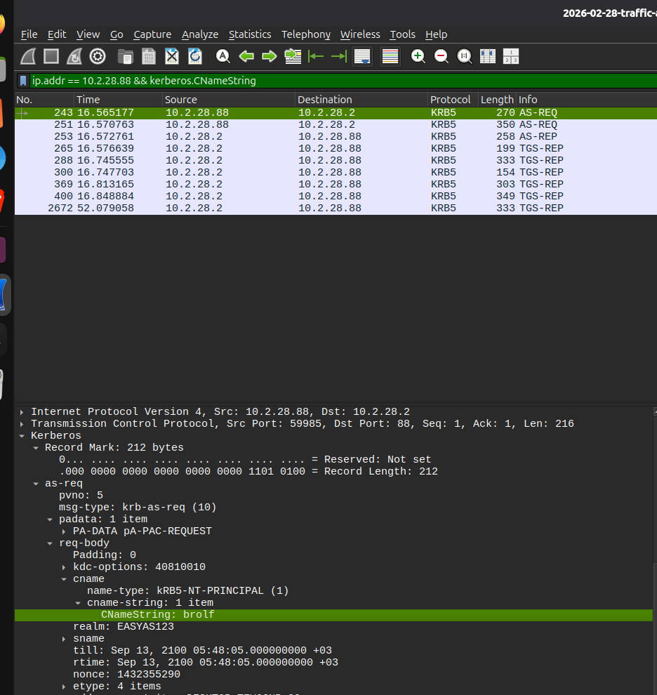
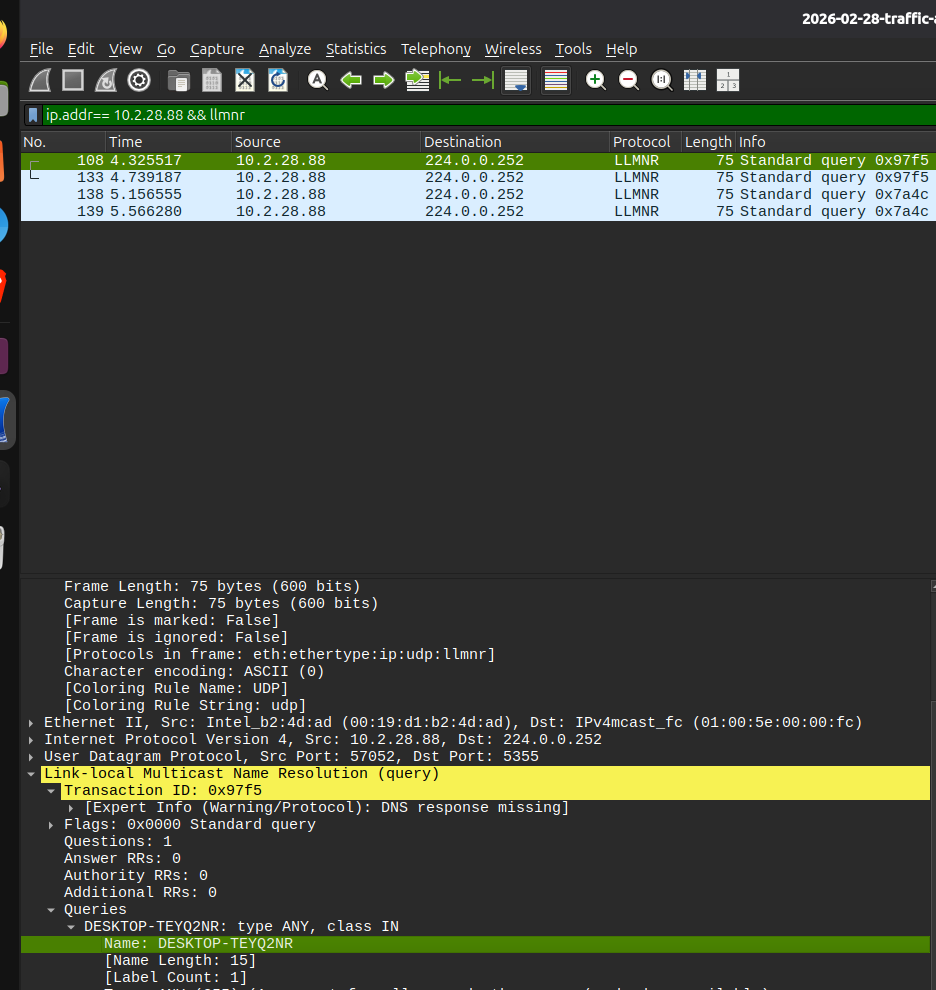
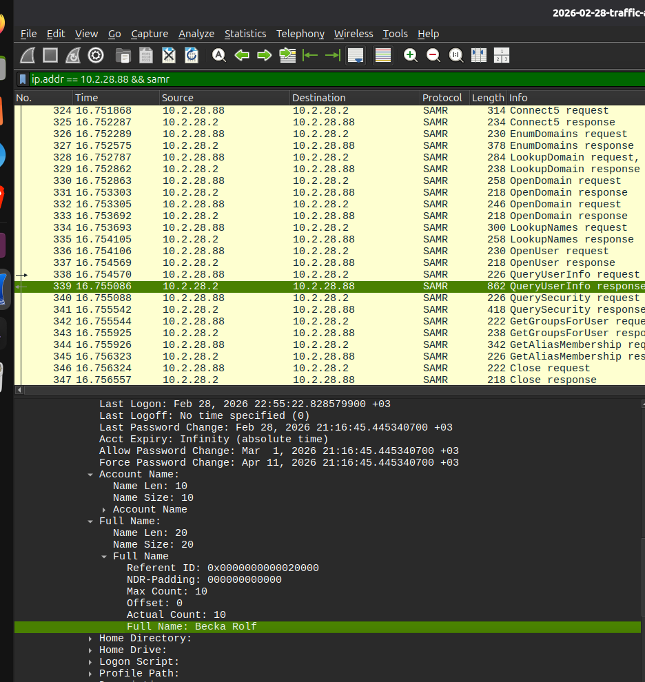

question: https://www.malware-traffic-analysis.net/2026/02/28/index.html


## Question 1 & 2: What is the IP address and MAC address of the infected Windows client?

The SIEM alert showed that the NetSupport Manager RAT was communicating with the external IP address `45.131.214.85` over TCP port `443`. Therefore, I started my investigation by looking for traffic involving this IP address.

I first used:

```
ip.addr == 45.131.214.85
```

This showed traffic between the external IP and several hosts. I then narrowed the results to traffic going to TCP port 443:

```
ip.addr == 45.131.214.85 && tcp.dstport == 443
```

From the results, I noticed that `10.2.28.88` was repeatedly sending traffic to `45.131.214.85` on port `443`. The traffic also contained repeated HTTP POST requests. Since the exercise identifies `45.131.214.85:443` as the NetSupport Manager RAT traffic, and the PCAP shows `10.2.28.88` repeatedly communicating with this IP and port, I identified `10.2.28.88` as the infected Windows client.

**Infected IP address: `10.2.28.88`**

After identifying the infected IP, I checked the packet details to find information about the network interface of this computer. In the Ethernet II section, the source MAC address was shown as:

**MAC address: `00:19:d1:b2:4d:ad`**



## Question 3: What is the hostname of the infected Windows client?

After finding the infected IP address, I used it to investigate the local Windows traffic:

```
ip.addr == 10.2.28.88 && llmnr
```

The results showed LLMNR queries generated by `10.2.28.88`. When I opened one of the packets and checked the packet details, I found the computer name in the query.

The hostname was:

**`DESKTOP-TEYQ2NR`**

This identifies the name of the infected Windows computer.




## Question 4: What is the Windows user account name?

Next, I needed to find which Windows account was being used on the infected computer. I searched the Kerberos traffic from the infected IP using:

```
ip.addr == 10.2.28.88 && kerberos.CNameString
```

The `CNameString` field in the Kerberos packet contains the account name. After opening one of the packets, I found:

**Account name: `brolf`**

Therefore, `brolf` is the Windows user account associated with the infected computer.




## Question 5: What is the full name of the user?

Finally, I wanted to find the user's actual full name. I searched for SAMR traffic from the infected computer:

```
ip.addr == 10.2.28.88 && samr
```

The results contained several SAMR requests and responses. I opened the `QueryUserInfo response` because it contains information about the Windows user account.

Inside the packet details, I found the **Full Name** field:

**Full name: `Becka Rolf`** 


