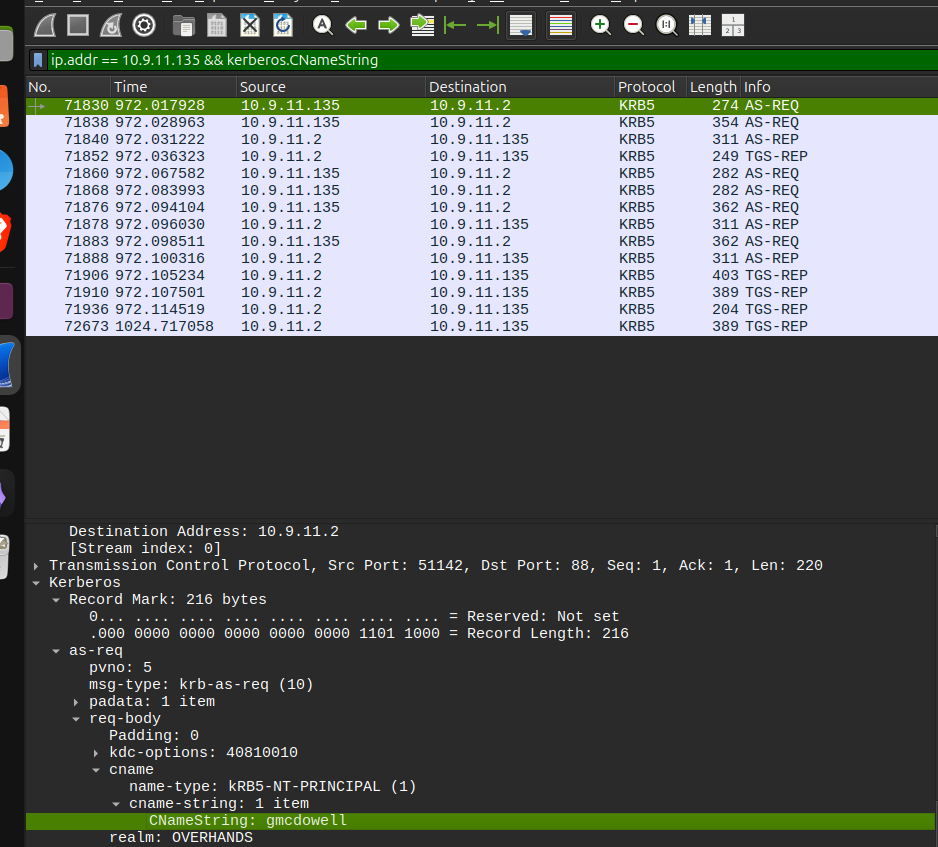
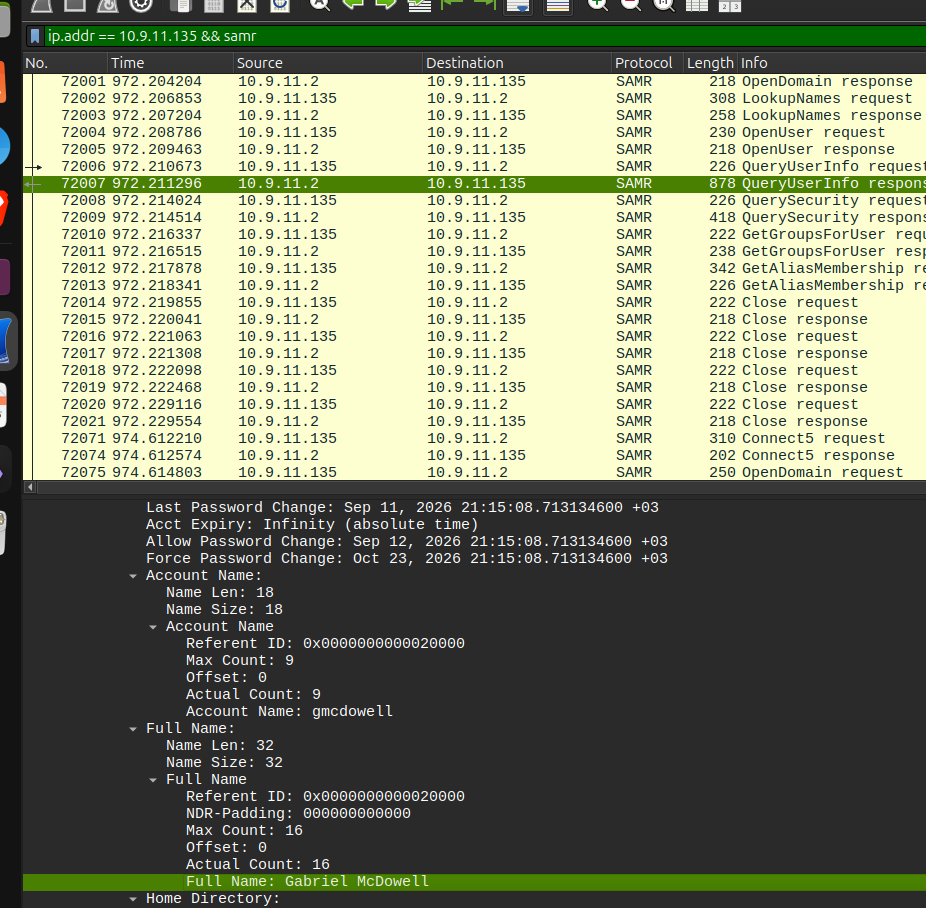

**LAB source**: https://www.malware-traffic-analysis.net/2026/09/11/index.html
## Task 1 & 2 – Identify the IP Address and MAC Address

I started by using this Wireshark filter:

```
http.request.method == GET
```

This filter helped me find the HTTP GET requests from the infected machine. I then checked the packet details to find the source IP address and MAC address.

**IP Address:** `10.9.11.135`  
**MAC Address:** `08:d4:0c:7a:29:1e`


## Task 3 – Identify the Windows User Account

For this task, I used:

```
ip.addr == 10.9.11.135 && kerberos.CName.String
```

I used `ip.addr` to focus on the traffic from the infected machine instead of going through all the IP addresses.

Then I used `kerberos.CName.String` to find the client/user account name in the Kerberos traffic.

The packet showed:

```
CNameString: gmcdowell
```

So the Windows user account name is:

**`gmcdowell`**




## Task 4 – Identify the Full Name of the User

For this task, I used:

```
ip.addr == 10.9.11.135 && samr
```

I used `ip.addr` again to filter the traffic and focus on the infected machine.

I then looked through the **SAMR** traffic. SAMR is a Windows protocol that can provide information about user accounts and groups.

I found a `QueryUserInfo` response containing:

```
Account Name: gmcdowell
Full Name: Gabriel McDowell
```

So the full name of the user is:

**Gabriel McDowell**





Answers: 
Victim Details:
IP address: 10.9.11.135
Host name: DESKTOP-6T17ZFM
MAC address: 08:d4:0c:7a:29:1e
Windows user account name: gmcdowell
Full name of the user: Gabriel McDowell
