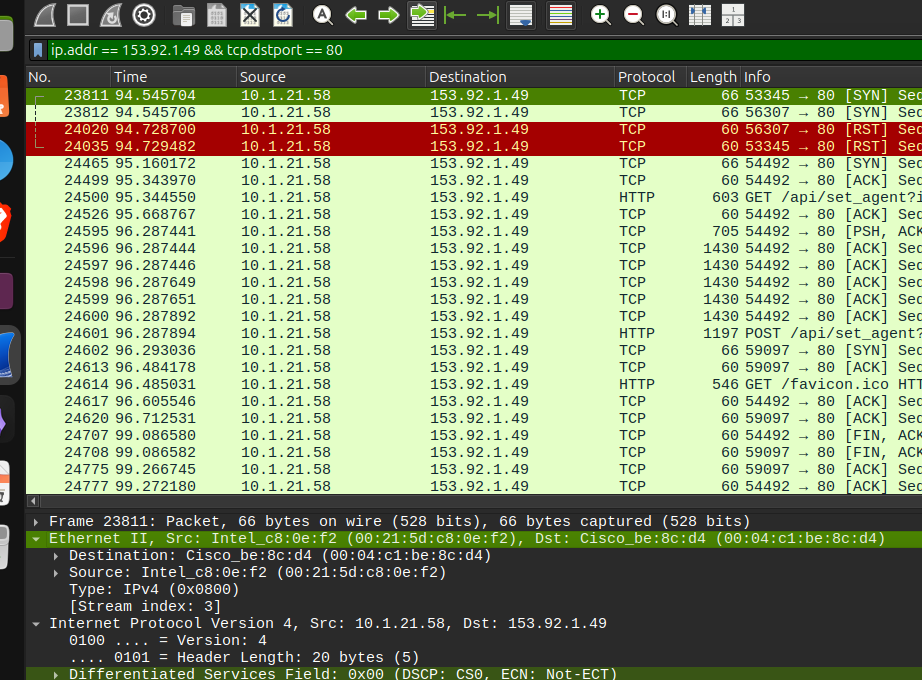
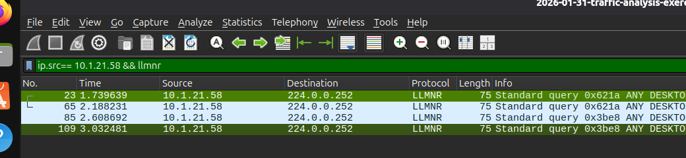
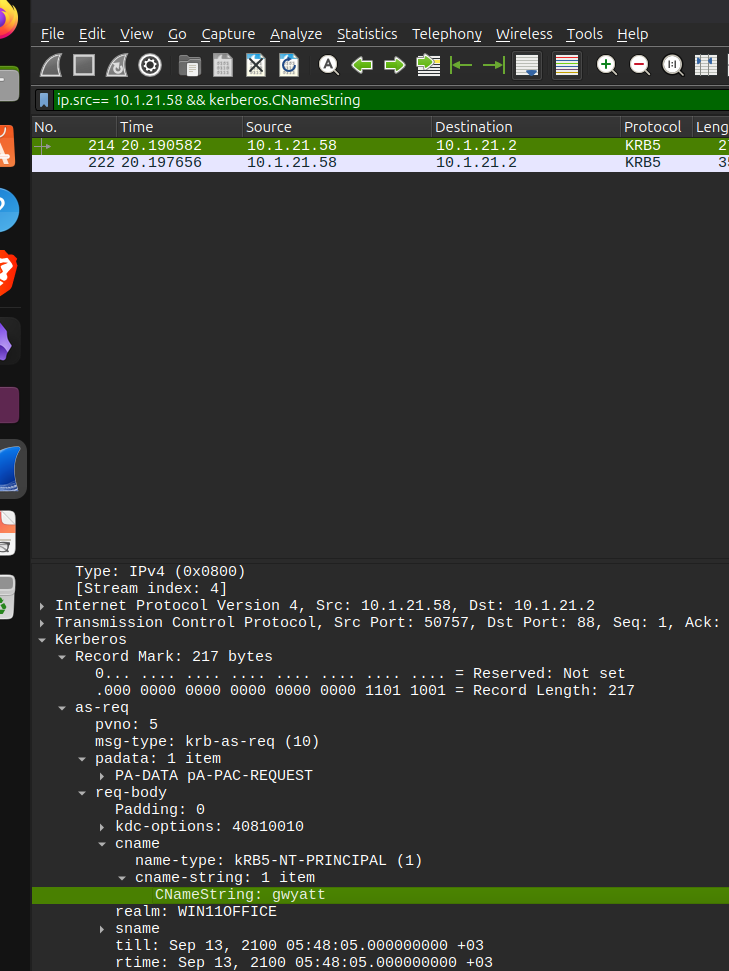
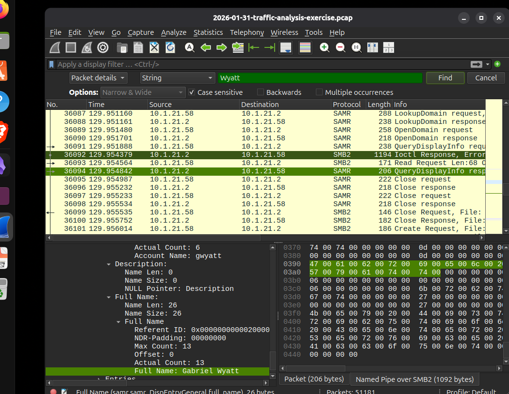
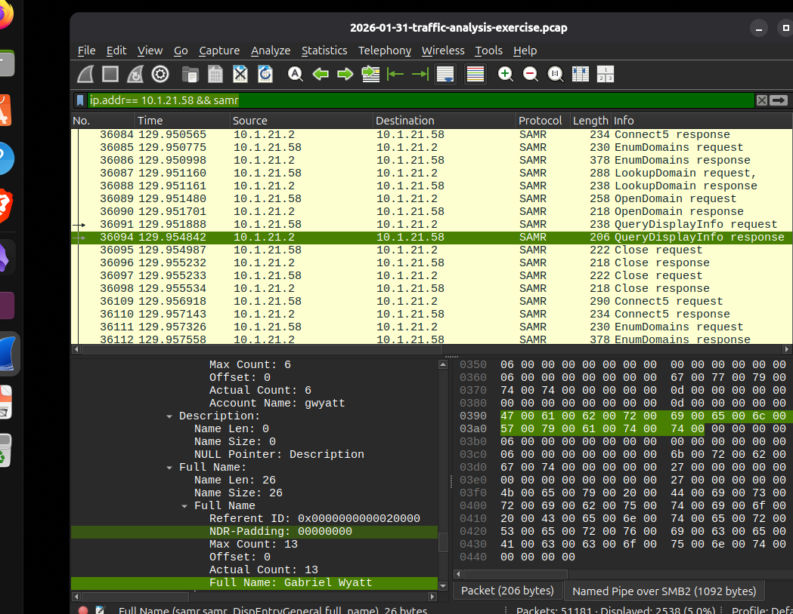
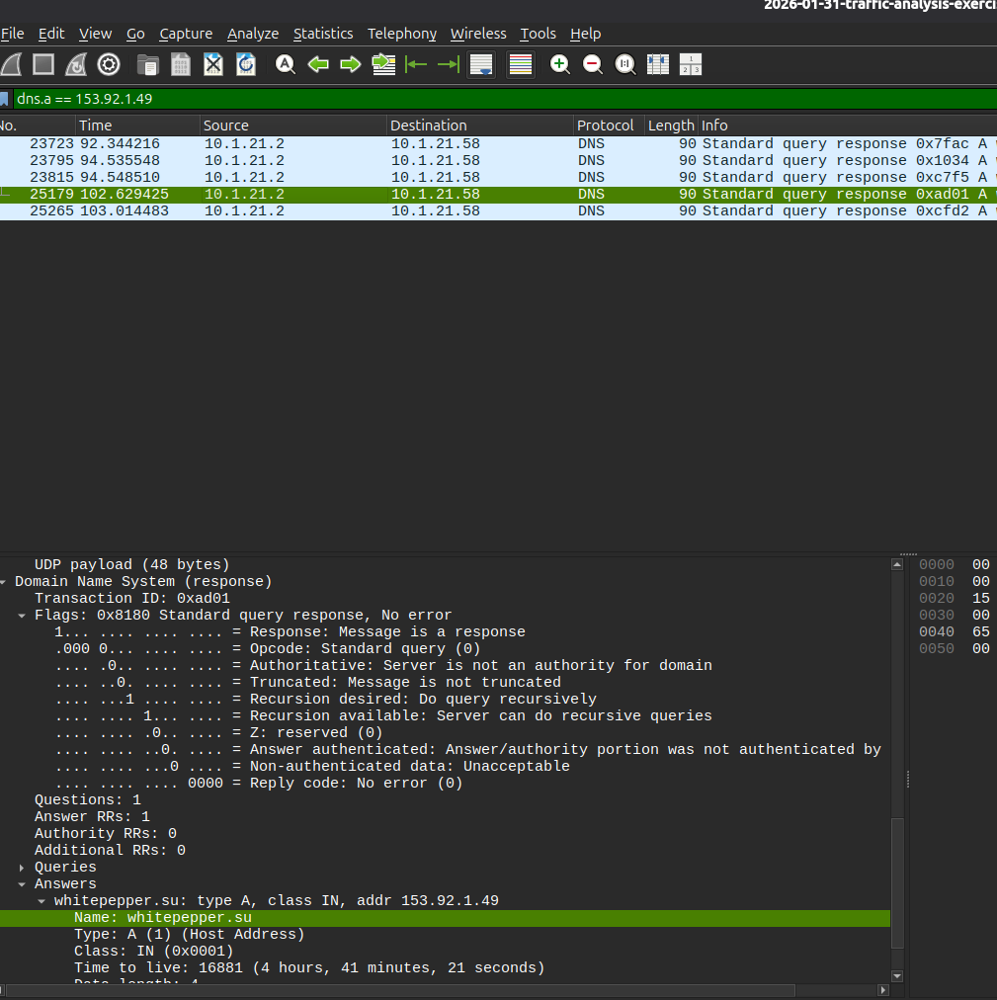

# Wireshark Lab 4 — Traffic Analysis

## Introduction

In this lab, I used **Wireshark** to analyze a PCAP file and investigate an alert related to **Lumma Stealer**.

The main goal was to find the infected Windows computer and collect information about it, such as its IP address, MAC address, hostname, Windows account, user's full name, and the suspicious domain.

---

## Question 1 & 2: What is the IP address and MAC address of the infected Windows client?

The alert showed suspicious traffic involving the IP address:

```
153.92.1.49
```

and TCP port:

```
80
```

I started by using this filter in Wireshark:

```
ip.addr == 153.92.1.49 && tcp.dstport == 80
```

I used `ip.addr` because I wanted to find traffic involving the suspicious IP, and `tcp.dstport == 80` because the alert mentioned TCP port 80.

After applying the filter, I found traffic from:

```
10.1.21.58 → 153.92.1.49
```

So I identified the infected Windows client's IP address as:

```
10.1.21.58
```

### Finding the MAC address

After finding the infected IP, I selected one of the packets from `10.1.21.58` and opened the **Ethernet II** section in the packet details.

I found the source MAC address:

```
00:21:5d:c8:0e:f2
```

So the results are:

```
IP Address: 10.1.21.58
MAC Address: 00:21:5d:c8:0e:f2
```





## Question 3: What is the hostname of the infected Windows client?

Next, I wanted to find the hostname of the infected computer.

I used:

```
ip.addr == 10.1.21.58 && llmnr
```

I used `llmnr` because Windows can use LLMNR to resolve names on the local network.

After checking the packets, I found the hostname:

```
DESKTOP-ES9F3ML
```

So:

```
Hostname: DESKTOP-ES9F3ML
```



## Question 4: What is the user account name?

After finding the hostname, I wanted to find the Windows account being used on the computer.

I used this filter:

```
ip.src == 10.1.21.58 && kerberos.CNameString
```

I used `ip.src` because I wanted packets that were sent from the infected computer.

The Kerberos packet showed:

```
CNameString: gwyatt
```

Therefore, the Windows account name is:

```
gwyatt
```



## Question 5: What is the full name of the user?

Now that I had the account name `gwyatt`, I wanted to find the full name connected to that account.

I searched for SAMR traffic using:

```
ip.addr == 10.1.21.58 && samr
```

After inspecting the packet details, I found:

```
Account Name: gwyatt
Full Name: Gabriel Wyatt
```

**1.By filters** 


**2.By rules**  


## Question 6: What is the domain from 153.92.1.49?

The alert gave me the suspicious IP:

```
153.92.1.49
```

I wanted to find the domain associated with this IP.

I used:

```
dns.a == 153.92.1.49
```

I used `dns.a` because an **A record** contains an IPv4 address associated with a domain.

The DNS response showed:

```
whitepepper.su → 153.92.1.49
```

So the domain I found was:

```
whitepepper.su
```



**Victim Details:
IP address: 10.1.28[.]58
Host name: DESKTOP-ES9F3ML
MAC address: 00:21:5d:c8:0e:f2
Windows user account name: gwyatt
Full name of the user: Gabriel Wyatt
Domain name: Whitepepper** 
